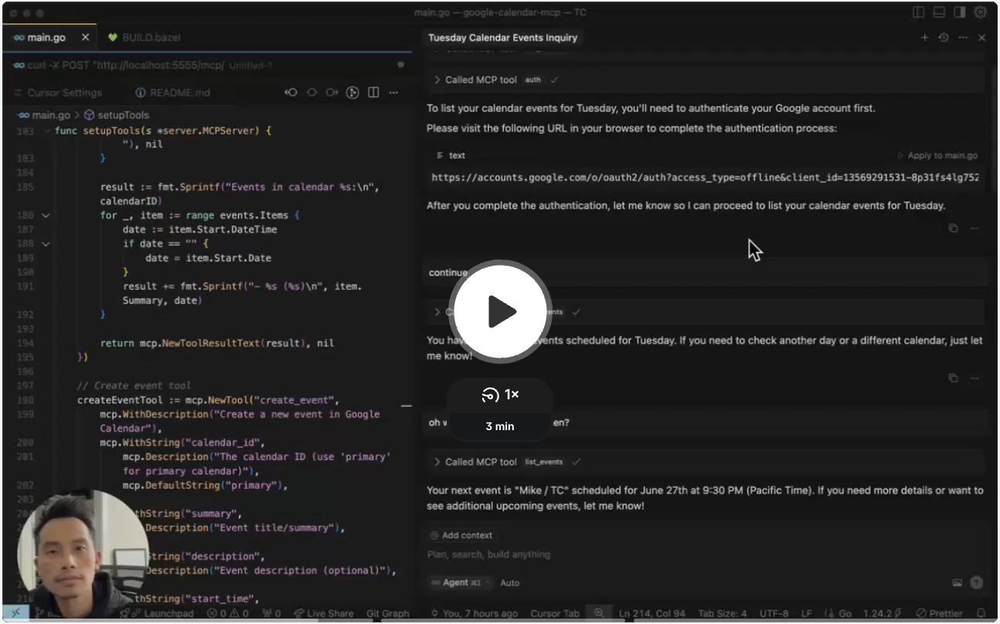

# Net New

<a href="https://www.loom.com/embed/ee2f6df5ee874c4687484909eb37a9a0?sid=8b2fb4be-5e23-4547-a557-da63fd1fe6f2">
  
</a>


# Usage

Requirements:
- Bazel

Install Bazel:

```
$ brew install bazel
```

Run this Bazel command to build containerized MCP server without hassle!

```
$ bazel run //:build_image
```

Start the local MCP server

```
$ GOOGLE_CLIENT_ID=$GOOGLE_CLIENT_ID \
  GOOGLE_CLIENT_SECRET=$GOOGLE_CLIENT_SECRET \
  docker run --rm -p 5555:5555 gcr.io/mcp-google-calendar:latest
```

# Developer Note

You need two 3 terminals to test:
1. Run server
2. Start SSE session
3. Tool query

## Run server

```
$ GOOGLE_CLIENT_ID=$GOOGLE_CLIENT_ID \
  GOOGLE_CLIENT_SECRET=$GOOGLE_CLIENT_SECRET \
  go run main.go
```

## Start SSE session

```
$ curl -N http://localhost:5555/mcp/sse
```

## Tool query

Let's use `auth` as example:

```
curl -X POST "http://localhost:5555/mcp/message?sessionId={session}" \
  -H "Content-Type: application/json" \
  -d '{
    "jsonrpc": "2.0",
    "id": 2,
    "method": "tools/call",
    "params": {
      "name": "auth",
      "arguments": {}
    }
  }'
```

- `{session}` is from SSE's quick response right after you connect.